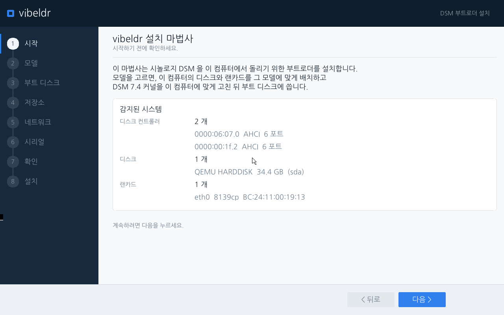
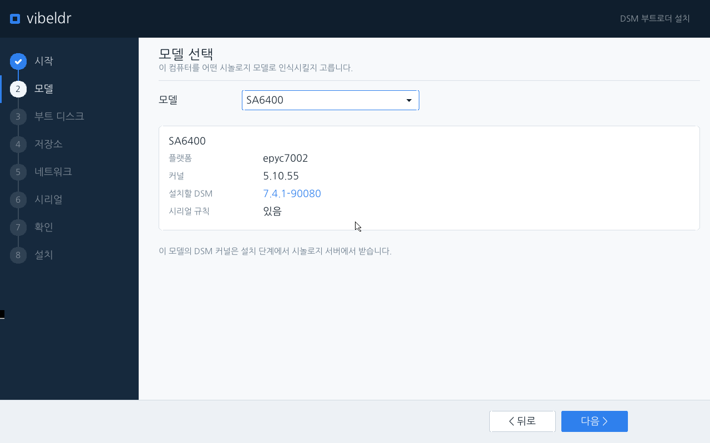
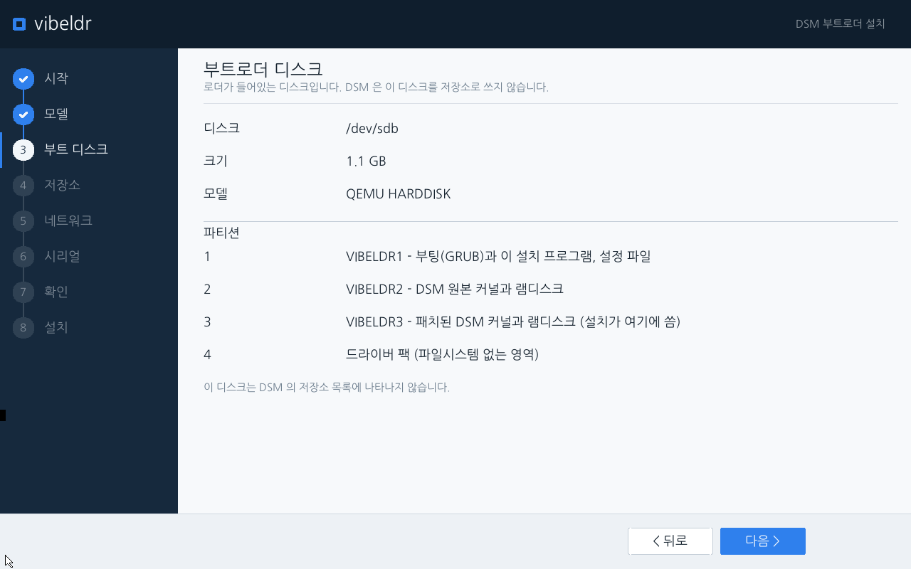
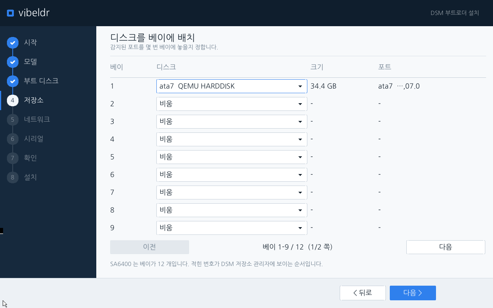
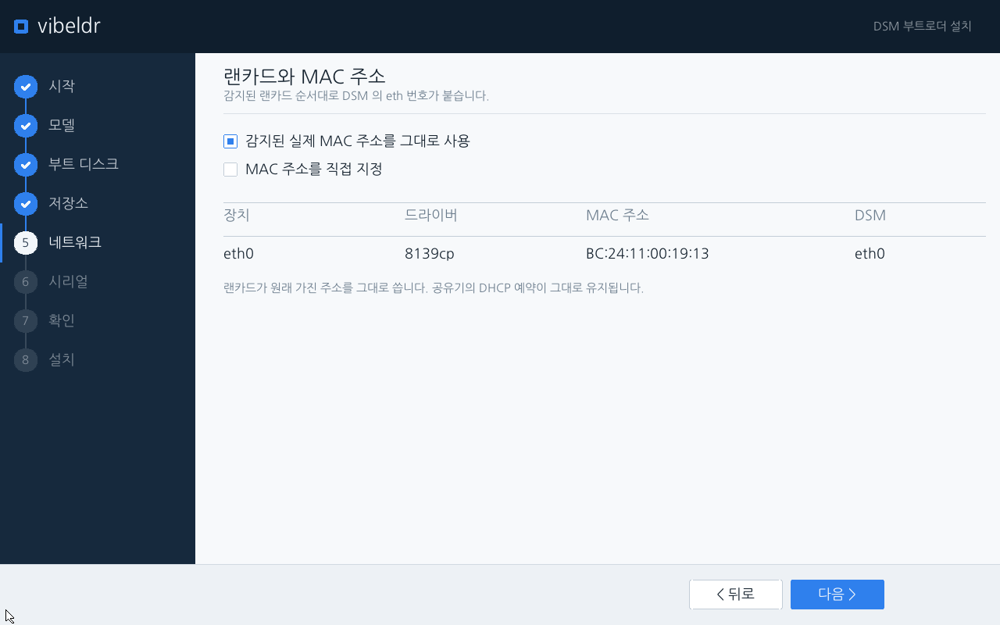
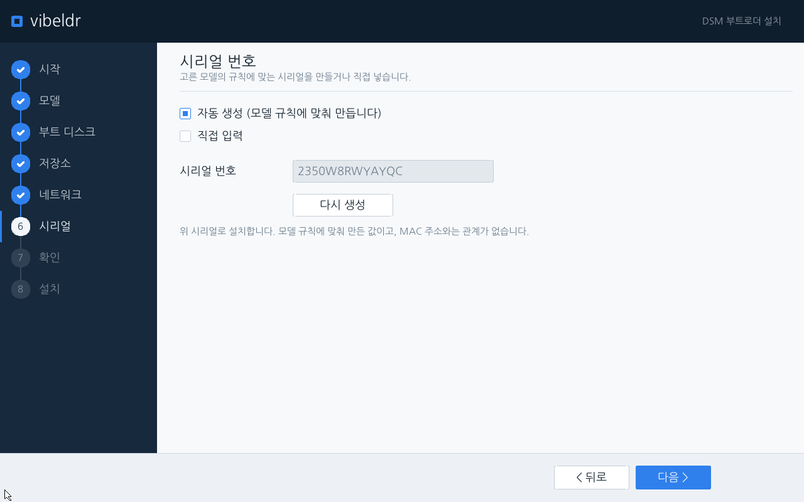
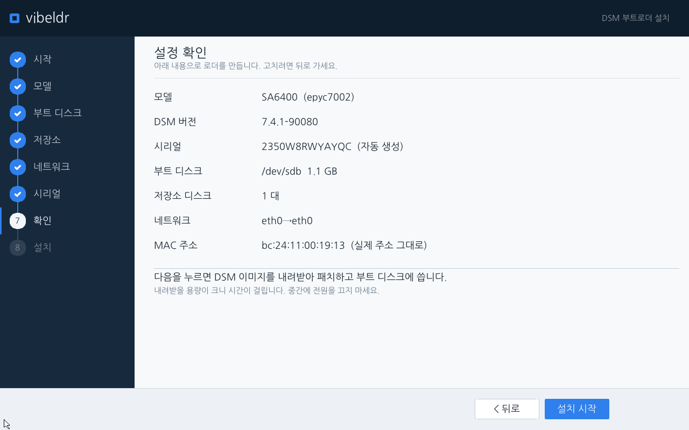
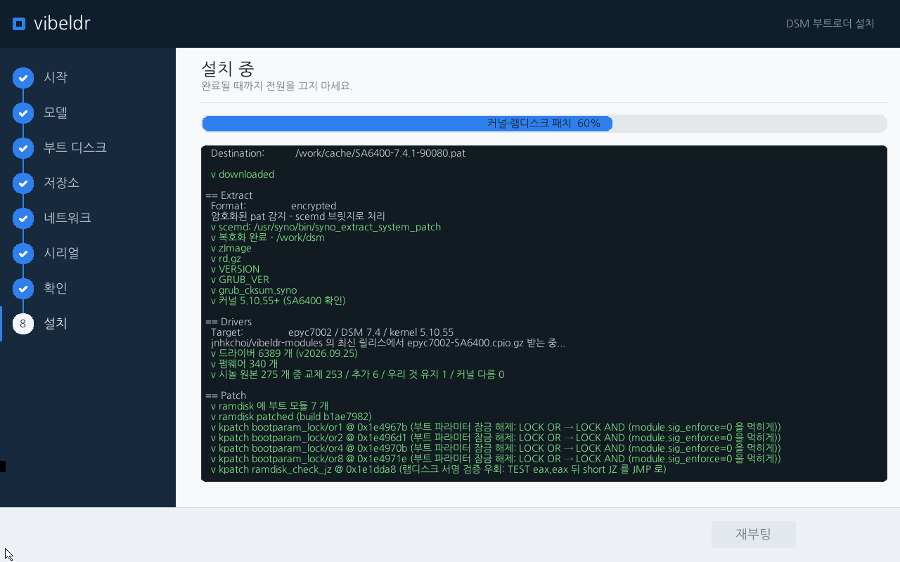
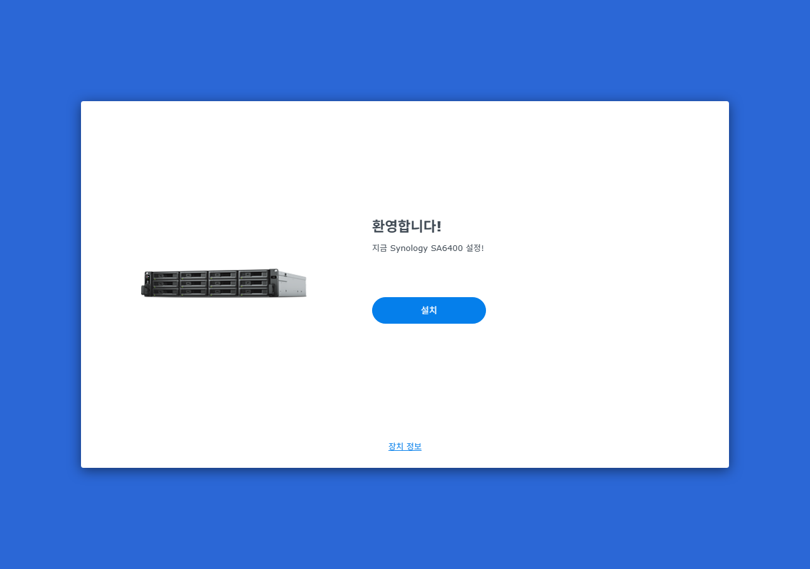

# vibeldr

*[한국어 README](README.ko.md)*

[](https://github.com/jnhkchoi/vibeldr/releases/latest)

A from-scratch x86 bootloader that runs **Synology DSM 7.4.1-90080** on ordinary
PC hardware, with a **graphical (framebuffer) install wizard** — pick a model,
lay out disks and NICs with the mouse, and it patches the DSM kernel and writes
the boot disk for you.

**[Download the loader image](https://github.com/jnhkchoi/vibeldr/releases/latest)**
— `vibeldr-loader.img.gz` (79 MB). Write it to a USB stick and boot; see
[Install](#install).

> **Disclaimer.** vibeldr is an independent research project. It is **not**
> affiliated with, authorized by, or endorsed by Synology. DSM itself is
> Synology's copyrighted software and is **not** included here — you supply your
> own `.pat`. Use it on hardware you own, for learning and personal use.

> **About this project.** This began purely out of curiosity about how
> Xpenology-style loaders work, and was built largely through AI-assisted
> ("vibe") coding. The author does not maintain the codebase and generally
> **cannot fix bugs or add features** — it is shared **as-is**, as a curiosity.

## Supported models

| Model | Platform | Kernel | Bays |
|---|---|---|---|
| DS918+ | apollolake | 4.4.302 | 4 |
| DS3622xs+ | broadwellnk | 4.4.302 | 12 |
| SA6400 | epyc7002 | 5.10.55 | 12 |

All on DSM **7.4.1-90080**. Verified end-to-end (install → DSM web setup) under
KVM/QEMU (Proxmox), booting from a USB loader disk.

## What makes it different

- **Graphical install wizard**, not a text menu. It renders on `/dev/fb0` with a
  sidebar, dropdowns, and a mouse cursor, and walks through 8 steps
  (start → model → boot disk → storage → network → serial → confirm → install).
- **No kernel module (LKM).** Instead of intercepting calls at runtime, vibeldr:
  - **patches the DSM `bzImage`** before boot to accept unsigned modules
    (boot-param lock `LOCK OR → AND`, ramdisk-check `JZ → JMP`), computing the
    byte offsets from the kernel image each time — no hardcoded addresses;
  - injects a small **userspace helper** into the DSM ramdisk that maps disk
    bays, forces the NIC MAC, neutralizes firmware flashers, and fixes the drive
    compatibility DB.
- **Forces the real NIC hardware MAC**, so your router/DHCP sees the chosen MAC.
- **Auto storage mapping**: `SataPortMap`/`DiskIdxMap` derived from the detected
  controllers for legacy platforms, device-tree slots for DT platforms.
- **DSM kernel fetched at install.** It comes from Synology's own download
  servers and is unpacked on the machine, not shipped with the loader.

## Requirements

- A target x86-64 machine (or VM) you own.
- A **USB** disk (~1 GB) for the loader — DSM only recognizes USB / SATA-DOM as
  its boot device.
- At least one data disk for DSM.
- Screen + keyboard + mouse for the wizard; a wired NIC for DSM.
- Internet access on the target during install — the loader fetches the DSM
  image straight from Synology, and the DSM web assistant then installs DSM
  itself (online, or from a `.pat` you upload).

## Build

Optional — the released image is built with exactly this command, so you can
reproduce it yourself instead of trusting the binary. Go (the Linux helper is
built automatically; the tool itself runs on Windows/Linux/macOS):

```bash
go run ./cmd/vibeldr bootstrap --no-embed
```

This produces `work/out/bootstrap.img`, a model-agnostic loader image. The DSM
`.pat` for the chosen model and its driver and firmware packs (from the latest
release of [vibeldr-modules](https://github.com/jnhkchoi/vibeldr-modules)) are
fetched at install time, so the target needs internet access during the install step.
The pack holds our builds only; Synology's own modules are taken from the `.pat`
and merged in during the install. `--driver-pack <cpio>` puts a pack on the
image beforehand.

## Install

The image boots the graphical wizard from `/dev/fb0`, so the target needs a
console/display. Each machine (or VM) needs its **own copy** of the image — the
loader writes the patched kernel back onto it.

### Proxmox / KVM

Run on the Proxmox host. The VM uses SeaBIOS + q35 and the default CPU type and
display; the loader is attached as a **removable USB** disk because DSM only
accepts USB / SATA-DOM as its boot device. The install runs in RAM, so give the
VM 4 GB of memory (the amount tested).

```bash
# 1) unpack a copy of the image into the ISO storage (one copy per VM)
gunzip -c vibeldr-loader.img.gz > /var/lib/vz/template/iso/vibeldr-900.img

# 2) create the VM (virtio, e1000e and rtl8139 NICs are tested)
qm create 900 --name vibeldr --machine q35 --cores 2 --memory 4096 \
  --net0 virtio=BC:24:11:00:00:01,bridge=vmbr0

# 3) a data disk for DSM (32 GB or more)
qm set 900 --sata0 local-lvm:32

# 4) attach the loader image as a removable USB disk; bootindex=1 boots it first
qm set 900 --args "-device qemu-xhci,id=xhci,addr=0x18 \
  -drive file=/var/lib/vz/template/iso/vibeldr-900.img,if=none,id=drive-usb0,format=raw \
  -device usb-storage,bus=xhci.0,drive=drive-usb0,id=usb0,bootindex=1,removable=on"
qm set 900 --boot 'order=sata0;net0'

# 5) start it and open the console
qm start 900
```

A self-built image is `work/out/bootstrap.img`; copy it in place of step 1.

### Bare metal

1. Write the image to a USB stick (this **erases** the stick):
   - Windows: [balenaEtcher](https://etcher.balena.io/) takes the downloaded
     `.img.gz` as-is; Rufus needs it unzipped to `.img` first.
   - Linux/macOS: `gunzip -c vibeldr-loader.img.gz | sudo dd of=/dev/sdX bs=4M status=progress conv=fsync`
     — replace `/dev/sdX` with the USB device; **double-check the device name.**
2. In the target's BIOS/UEFI: disable **Secure Boot**, and set it to boot from
   the USB stick (try Legacy/CSM if the USB entry doesn't appear).
3. Power on — the wizard appears on screen. Follow it, then finish DSM setup in a
   browser via `http://find.synology.com` or `http://<the box's IP>:5000`.

## Wizard walkthrough (SA6400 example)

The 8 steps are the same for every model; only the model card and the bay count
differ (DS918+ shows 4 bays, the others 12).

| | |
|---|---|
| **1. Start** — review detected disks/NICs |  |
| **2. Model** — pick the Synology model |  |
| **3. Boot disk** — the loader disk (not used as DSM storage) |  |
| **4. Storage** — place disks into bays |  |
| **5. Network** — NIC / MAC (real MAC kept by default) |  |
| **6. Serial** — model-rule serial (auto or manual) |  |
| **7. Confirm** — review the summary |  |
| **8. Install** — download DSM and the driver/firmware packs, add Synology's own modules, patch, write, reboot |  |

After it finishes, reboot into DSM and open the web UI to complete setup:



## How it works (short)

1. GRUB loads a small Alpine kernel + our initrd; the wizard runs on the
   framebuffer.
2. You pick a model and lay out disks/NICs. The loader downloads that model's
   DSM image from Synology, unpacks it, patches the `bzImage`, injects the
   userspace helper into the DSM ramdisk, writes the patched kernel to the boot
   partition, and stages a driver pack.
3. On reboot the DSM installer comes up; you upload your `.pat` and finish setup
   in the DSM web UI.

## Credits

vibeldr is original code, but it stands on the shoulders of the community loaders
and their research. In particular:

- **[RedPill](https://github.com/RedPill-TTG/redpill-lkm)** — the reference for
  what DSM checks at boot/install (sig-enforce, ramdisk check, firmware-flash
  blocking) that vibeldr reproduces without a kernel module.
- **[Arc](https://github.com/AuxXxilium)** (`AuxXxilium/arc-modules`) and
  **[M-shell / TinyCore-RedPill](https://github.com/PeterSuh-Q3)**
  (`PeterSuh-Q3/tcrp-modules`) — the modules vibeldr-modules takes from their
  packs where we lack a driver or theirs is better (its README lists each one),
  and a reference for `SataPortMap`/`DiskIdxMap` and flasher handling.
- **[ARPL / rr](https://github.com/RROrg/rr)** — general prior art for automated
  Synology loaders.
- **[007revad](https://github.com/007revad)**
  ([Synology_HDD_db](https://github.com/007revad/Synology_HDD_db),
  [Synology_M2_volume](https://github.com/007revad/Synology_M2_volume)) — the
  reference for making third-party drives pass DSM's compatibility DB / rule
  engine, which vibeldr applies automatically.

Thanks to everyone in the XPEnology community.

## License

To be decided by the author. Until a `LICENSE` file is added, all rights are
reserved. (These loaders commonly use GPL-3.0.)
